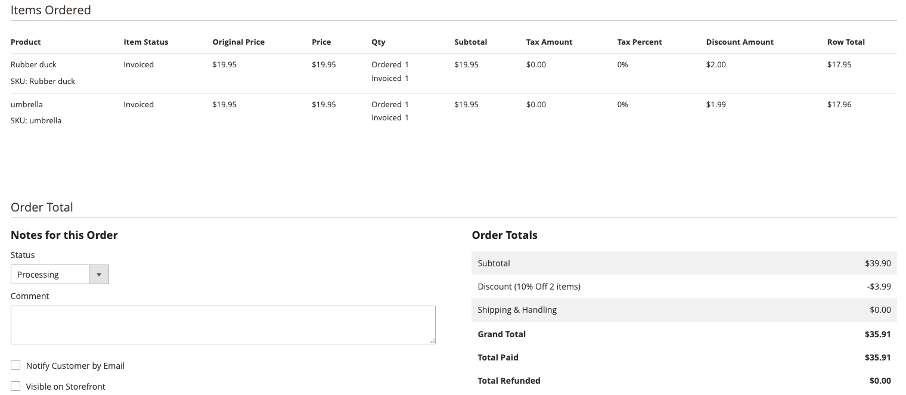

# Crear reglas de precio del carro

Las reglas de precios del carro de compras aplican descuentos a los artículos del carro de compras en función de las condiciones establecidas. El descuento se puede aplicar automáticamente cuando se cumplen las condiciones o cuando el cliente introduce un código de cupón válido. El descuento aparece en el carro de compras bajo el subtotal. Puede activar o desactivar una regla para una temporada o promoción cambiando su estado y el intervalo de fechas.

## ¿Para quién es este vídeo?

* Especialistas en marketing electrónico
* Administradores de sitios web

## Contenido de vídeo

* Crear reglas de precios de carro de compras y códigos de cupones opcionales.
* Consulte cómo aparecen los descuentos en el carro de compras y en las promociones.

>[!VIDEO](https://video.tv.adobe.com/v/343835?learn=on)

## Problemas de visualización de precios

En algunos casos, cada elemento de línea debe mostrar el descuento aplicado, pero es posible que los valores mostrados no coincidan exactamente. Esto sucede cuando una regla de precio del carro de compras aplica un descuento en varios productos y la división no se divide uniformemente en dos decimales.

>[!BEGINSHADEBOX]

Regla de precio del carro de compras = 10 % de descuento aplicado a 2 productos del carro de compras
Condición para que la regla de precio surta efecto: el total de artículos en el carro es 2
Las acciones aplican un porcentaje de descuento en el precio del producto y ese importe de descuento es de 10

Se agregan 2 elementos al carro de compras, cada uno por valor de 19,95 $

Para obtener la cantidad de descuento multiplicar el precio del producto por 0,1

19,95 x 0,1 = 1,995

Este es el problema, tenemos 3 decimales, en lugar de dos. Convertir esto a dólares es ahora un problema

>[!ENDSHADEBOX]

### La solución

Para el comerciante en la Administración, el enfoque más claro es mostrar cada línea solicitada con su descuento en dólares. Para mantener el total del pedido correcto, redondee el primer elemento de línea hacia arriba y suelte el tercer decimal en los elementos de línea restantes. Revise este escenario:

>[!BEGINSHADEBOX]

Mismo descuento del 10% que la regla de carro de compras anterior en vigor
Añadir 2 productos al carrito que sean 19,95

Cada producto debería obtener 1,995 $ de descuento
Producto 1 - 19,95 x 0,1 = 1,995
2 - 19,95 x 0,1 = 1,995

Se proporciona un total de 3,99 como descuento al cliente

Al mostrar los elementos de línea al propietario de la tienda en el administrador,
tenemos que ajustar el primer elemento y redondearlo a 2.000. Para el segundo elemento, suelte el tercer decimal.
Producto 1 = 2,00
Producto 2 = 1,99

El descuento total de los dos productos ahora, cuando se suman, coincide con el descuento real proporcionado a un cliente.
>[!ENDSHADEBOX]

Esta es una captura de pantalla como se mostraría en el administrador para un pedido que tenga este escenario:

### Otras soluciones potenciales y por qué no se utilizaron

>[!BEGINSHADEBOX]

Mismo descuento del 10% que la regla de carro de compras anterior en vigor
Añadir 2 productos al carrito que sean 19,95

Cada producto debe obtener $ 1.995 en descuentos,
sin embargo, si solo los redondeamos, muestra demasiado descuento.

Producto 1 - 19,95 x 0,1 = 1,995
Producto 2 - 19,95 x 0,1 = 1,995

Convertir para redondear todos los elementos
Product 1 El nuevo valor es 2,00
Product 2 El valor nuevo es 2,00

Se proporcionó un total de 3,99 como descuento al cliente.
sin embargo, si redondeamos, mostraría que se dieron $4.00, y eso es incorrecto.

2,00 + 2,00 = 4,00 $

>[!ENDSHADEBOX]

Problema similar si se elimina el tercer decimal para todos los artículos, se mostraría muy poco descuento proporcionado.

>[!BEGINSHADEBOX]

Mismo descuento del 10% que la regla de carro de compras anterior en vigor
Añadir 2 productos al carrito que sean 19,95

Cada producto debería obtener 1.995 $ en descuentos, sin embargo, si solo bajamos el tercer decimal, esto sucede:
Producto 1 - 19,95 x 0,1 = 1,995
Producto 2 - 19,95 x 0,1 = 1,995

Convertir para soltar el tercer decimal para todos los elementos
Product 1 El nuevo valor es 1,99
Product 2 El nuevo valor es 1,99

Se proporcionó un total de 3,99 como descuento al cliente.
sin embargo, si soltamos el tercer decimal, mostraría que se dieron 3,98 dólares, y eso es incorrecto.

1,99 + 1,99 = 3,98 $

>[!ENDSHADEBOX]

## Recursos adicionales

* [Crear una regla de precio de carro de compras - [!DNL Commerce] Guía de promociones y comercialización](https://experienceleague.adobe.com/docs/commerce-admin/marketing/promotions/cart-rules/price-rules-cart-create.html?lang=es){target="_blank"}
* [Códigos de cupón - [!DNL Commerce] Guía de promociones y comercialización](https://experienceleague.adobe.com/docs/commerce-admin/marketing/promotions/cart-rules/price-rules-cart-coupon.html?lang=es){target="_blank"}
